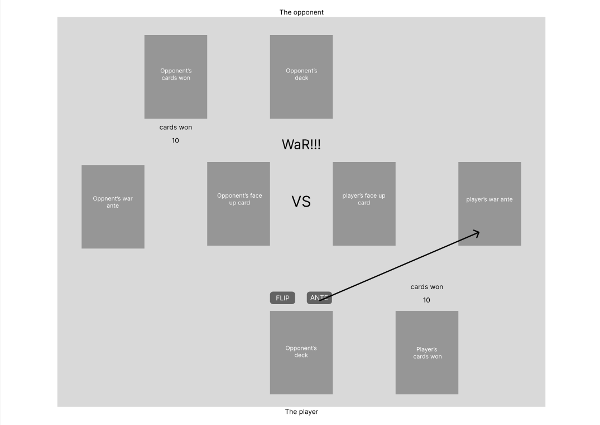

Game: War

### Game overview // planning : pseudo

1) User starts game - click start button
    1. deck shuffles 52 cards (randomized)
    2. deck is split in half (26 cards) for each player
2) User clicks a 'flip' button to reveal the top card of thier deck( and opponents).
    1. the two revealed cards are compaired
    2. the higher value card wins (decision)
    3. the winning player receives both cards in the 'won cards' area
3) Repeat until either user or opponent have zero cards in deck.
    1. cards from the corresponding "won cards pile" will be shuffled back into corresponding deck.
4) Game ends when either user or the opponent has zero cards in deck + zero cards in "won cards pile" at any time.
    1. user wins if opponent has no more cards to flip.
    2. opponent wins if user has no more cards to flip.

TIE - In case of tie, WaR is initiated. A tie is when both the user and the opponent reveal cards of equal value.

5) The 'ante' button is activated and other buttons are deactivated.
6) the user must click the 'ante' button to add 3 cards, face down, to the ante pile. The current revealed card (the one that initiated war) is also added to the ante pile.
    - ante button disabled
    - flip button enabled
7) User clicks a 'flip' button to reveal the top card of thier deck( and opponents).
    1. the two revealed cards are compaired
    2. the higher value card wins (decision)
    3. the winning player receives both cards + all cards from both player's ante in the 'won cards' area
8) repeat war cycle until there are not ties.
9) return to normal play (flip a card)

### WIREFRAME

