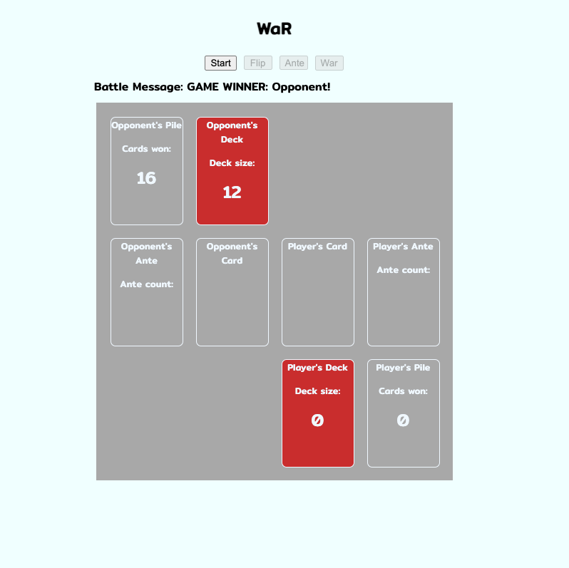

# WAR!: Card battle game
### Win all the cards.
Two players, each play from half of a shuffled deck of cards. The top card of each deck is revealed and the highest value card, wins the card battle. The winner of the card battle places them in a side pile. If there is a tie, there's a war! Three cards from each players deck are ante'd up and then the fourth card from the top of the deck is revealed. The player that wins the war keeps all the ante'd cards plus, all the revealed cards. The process repeats until one of the two players has no more cards to continue playing.

## Screenshot:

## Technologies
This game was created using <b>HTML</b>, <b>CSS</b> and <b>JavaScript</b>

## Getting Started: 
Try the game - 
[play War](https://cwest9400.github.io/War/)

1. Start by clicking 'start'.
2. Click 'Flip' to make a play.
    - The cards are compared for highest valueand sent to the cards won pile.
3. If both revealed cards have an equal value, War is initiated!
    - Click the 'Ante' button to ante 3 cards from your deck
    - Click the 'War!' button to flip another card!
        - The winner takes all the cards in play!
4. Try to win all the cards.        

## Next Steps:
- Additional CSS styling - play area and card visuals.
- Card animations - Cards sliding from zone to zone.
- Button updates - Reduce the number of buttons that the user needs to interact with.
- The ability to ante more that 3 cards at a time.
- game timer

### Code Snippets

HTML
```
<div class="container">
    <div class="playArea">
      //ALL The card placeholders are in here.      
    </div>
</div>
```
CSS
```
.container {
    display: grid;
}

.playArea {
    background-color: rgb(168, 168, 168);
    width: auto;
    height: auto;
    margin: auto;
    display: grid;
    padding: 20px;
    grid-template-columns: 100px 100px 100px 100px;
    grid-template-rows: 150px 150px 150px;
    column-gap: 20px;
    row-gap: 20px;
}
```

JAVASCRIPT - Flip Button
```
function flipCard() {
    player.faceUpCard = player.deck[player.deck.length - 1]
    opponent.faceUpCard = opponent.deck[opponent.deck.length - 1]
    playerCardView.textContent = player.faceUpCard
    opponentCardView.textContent = opponent.faceUpCard
    player.deck.pop()
    opponent.deck.pop()
    setTimeout(function () { cardCompare() }, 900)
    if (player.deck.length <= 1 || opponent.deck.length <= 1) {
        setTimeout(function () { remakeDeckfromCardsWon() }, 1000)
    }
    playerDeckSize.textContent = player.deck.length
    opponentDeckSize.textContent = opponent.deck.length
}
```
### Challenges/TakeAways

Dedicating brain power on the most important pieces - Focus on the step at hand, not on how to make something else work later down the road.

Ex: Before worrying about how to compare cards - we should shuffle the deck first.

Planning is KEY - starting broad(because you shouldn't know the details yet) and working inward later.


